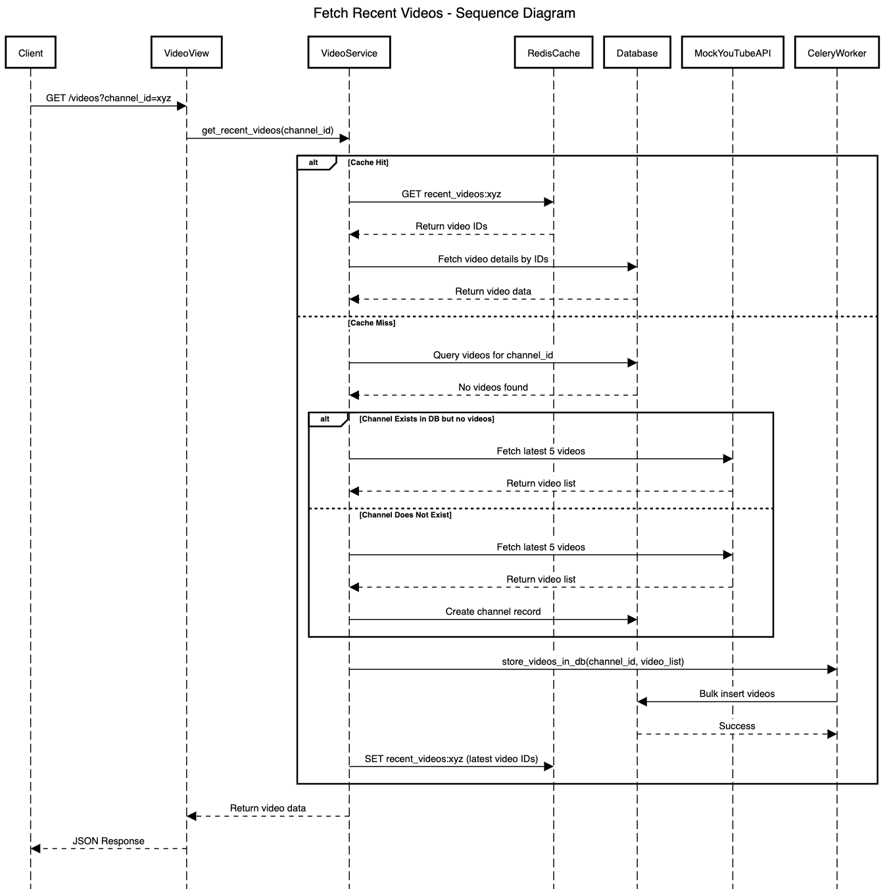

# 🚀 Video Retrieval Microservice

This microservice fetches the **latest 5 videos** for a given YouTube channel, optimized with **caching, database lookups, and external API fallback**.

## 📖 Table of Contents
- [1️⃣ Overview](#1-overview)
- [2️⃣ API Endpoints](#2-api-endpoints)
- [3️⃣ Assumptions](#3-assumptions)
- [4️⃣ Thought Process Behind the Design](#4-thought-process-behind-the-design)
- [5️⃣ Sequence Diagram](#5-sequence-diagram)
- [6️⃣ Future Enhancements](#6-future-enhancements)
- [7️⃣ Setup & Installation](#7-setup--installation)
- [8️⃣ Running the Application](#8-running-the-application)
- [9️⃣ Testing](#9-testing)

---

## **1️⃣ Overview**
The microservice is designed for **high-performance video retrieval**, ensuring **scalability, efficiency, and maintainability**.

---

## **2️⃣ API Endpoints**

### 🔹 `GET /videos?channel_id=<channel_id>`

**📥 Request Parameters:**
- `channel_id` (required) – The **unique ID of the YouTube channel**.

**📤 Response (Example):**
```json
{
  "UC6qq5ZRn_epjgdKwtgmeSd3": [
    {
      "video_id": "aWyckSMztx1",
      "video_title": "Example1 Video 1",
      "upload_date": "2024-03-21"
    },
    {
      "video_id": "aWyckSMztx2",
      "video_title": "Example1 Video 2",
      "upload_date": "2024-03-20"
    }
  ]
}
```
## **3️⃣ Assumptions**

Certain assumptions have been made while designing this microservice to ensure its efficiency and maintainability.


### **1️⃣ Data Management & Updates**  
- We assume that **another process or external system** is responsible for **keeping the database updated** with the latest videos for each channel.  
- The service **does not trigger full database updates**, but it can fetch new data from an **external API if needed**.  


### **2️⃣ Sorting & Video Retrieval**  
- Since the requirement is to return the **latest 5 videos**, we store and retrieve **videos sorted by `upload_date` in descending order**.  
- To handle cases where a channel **uploads multiple videos on the same day**, we rely on **`datetime` instead of just `date`** for precise ordering.  


### **3️⃣ Caching Strategy**  
- **Only the latest 5 video IDs per channel** are cached in **Redis** to minimize memory usage.  
- Cache **expires every 5 minutes**, assuming that video updates are **not too frequent** but still require periodic refreshing.  
- If a **cache miss** occurs, the system **fetches from the database**. If no data is found, it **queries the external API**.  


### **4️⃣ External API Handling**  
- If a channel **does not exist in the database**, the system **fetches the latest 5 videos** from the external API and **stores them asynchronously**.  
- We assume the **external API always returns a valid response** if the channel exists.  
- Any failures in fetching from the external API **do not impact the API response**, as we return cached or database-stored data when available.  


### **5️⃣ Scalability & Background Processing**  
- To **prevent API call bottlenecks**, storing newly fetched videos **does not block API responses** but happens asynchronously via **Celery tasks**.  
- A **separate periodic task** ensures **cached data remains fresh** by updating the cache from the database.  


### **🔚 Summary**  
- ✅ **Database updates are assumed to be handled externally.**  
- ✅ **Videos are sorted by full `datetime`, not just `date`.**  
- ✅ **Cache stores only the latest 5 videos per channel.**  
- ✅ **External API is used only when necessary.**  
- ✅ **Background tasks handle non-blocking updates.**  

---

## **4️⃣ Thought Process Behind the Design**

This microservice is designed for **high-performance video retrieval** while ensuring **scalability, efficiency, and maintainability**. Below is a breakdown of the key decisions made.


### **1️⃣ Data Modeling**
### 🔹 **Key Considerations**
- The system needs to handle **millions of videos and channels**.
- Queries must be **efficient** for retrieving the latest videos.
- The database should support **fast lookups** while maintaining relationships.

### 🔹 **Finalized Approach**
- A **Channel model** stores metadata about YouTube channels.
- A **Video model** stores video details, linking each video to a channel.
- A **last accessed timestamp** is stored for each channel to track active channels.


### **2️⃣ API Design**
### 🔹 **Choosing REST**
- The API is **RESTful**, making it easy to integrate with other services.
- A single **GET endpoint** allows fetching the **latest 5 videos** for a channel.

### 🔹 **How It Works**
1. **The API first checks the cache** for recent videos.
2. If the **cache is empty**, it queries the **database**.
3. If **no videos exist in the DB**, it **fetches from the external API**.
4. If fetched externally, the **videos are stored in the DB and cache** for future requests.


### **3️⃣ Caching Strategy**
### 🔹 **Why Use Redis?**
- **Reduces database load** by caching frequently accessed data.
- **Speeds up response times** significantly.
- **Stores only recent 5 video IDs per channel** to keep memory usage minimal.
- **Cache expiration** is set to refresh data periodically.
- **Back of envelope estimation** Key (41 bytes) + Value (80 bytes) + Overhead (40 bytes) ≈ 161 bytes
  -  Key (41 bytes) + Value (80 bytes) + Overhead (40 bytes) ≈ 161 bytes
  - 10 Mega Bytes / 161 bytes per entry ≈ 651,279 entries


### 🔹 **Cache Flow**
1. **Cache Check** → If recent videos exist, return them immediately.
2. **Cache Miss** → Fetch from DB, update cache.
3. **No Data in DB** → Fetch from external API, store in DB + cache.


### **4️⃣ Background Processing (Celery)**
### 🔹 **Why Use Celery?**
- Fetching new videos **should not block API responses**.
- The system must handle **high traffic** without degrading performance.
- Background jobs can **periodically refresh the cache**. ( Future Enhancement )

### 🔹 **How It Works**
- When new videos are fetched from an external API, a **background task** is triggered to **store them in the database asynchronously**.
- A **scheduled Celery task** updates Redis **every few minutes** to keep cache fresh. ( Future Enhancement )


### **5️⃣ Error Handling & Logging**
### 🔹 **Error Handling Approach**
- API responses follow the **JSON API specification**.
- Errors are structured with **status codes and descriptive messages**.
- Common cases handled:
  - **Missing channel ID** (400 Bad Request)
  - **Channel not found** (404 Not Found)
  - **Unexpected errors** (500 Internal Server Error)

### 🔹 **Logging for Debugging**
- Every **cache hit/miss, database query, and API call** is logged.
- Logs help **monitor performance and diagnose failures**.
- **Warnings are raised** when external API calls fail.


### **🔚 Final Thoughts**
✅ **Optimized for performance** with caching and indexing.  
✅ **Scalable architecture** with Celery background tasks.  
✅ **Failsafe design** ensures videos are **always fetched** (DB → API fallback).  
✅ **Structured logging & error handling** for better monitoring.  

---

## **5️⃣ Sequence Diagram**



---

## **6️⃣  Future Enhancements

While the current microservice is functional and optimized for performance, there are several improvements that can be made in the future to enhance **scalability, security, and developer experience**.


### **1️⃣ Background Cache Update & LRU Strategy**
### 🔹 **Current Issue**  
- The periodic **Redis cache update using Celery** is not fully functional.  
- **LRU (Least Recently Used) eviction strategy** is not implemented, meaning Redis may store **stale or excessive data** over time.

### 🔹 **Proposed Solution**  
- Implement a **scheduled Celery task** that proactively updates Redis with the **latest video data from the database**.  
- Use **Redis LRU eviction policy** to remove **least-accessed channels** from the cache, preventing memory overuse.


### **2️⃣ Token-Based Authentication with Policy Scopes**
### 🔹 **Current Issue**  
- The API is **open to any client** without authentication or authorization.  
- There is **no role-based access control** to restrict read/write privileges.

### 🔹 **Proposed Solution**  
- Implement **OAuth2 with JWT (JSON Web Tokens)** for **secure authentication**.  
- Introduce **policy-based scopes**:
  - ✅ **Read-Only Scope** → Allows clients to fetch videos.  
  - ✅ **Read-Write Scope** → Allows clients to fetch videos & manage their metadata.  
- This ensures **only authorized clients can access or modify data**.


### **3️⃣ Swagger UI for API Documentation**
### 🔹 **Current Issue**  
- The API lacks **interactive documentation**, making it harder for developers to understand and test endpoints.

### 🔹 **Proposed Solution**  
- Integrate **Swagger UI (drf-yasg)** to provide a **self-documenting API**.
- Developers can **test API endpoints directly** from the Swagger UI interface.
- This makes it easier to onboard new users and ensure **API contract compliance**.


### **4️⃣ Enhanced Error Logging & Monitoring**
### 🔹 **Current Issue**  
- API errors and Celery task failures are logged but **not actively monitored**.
- There is **no alerting mechanism** for system failures.

### 🔹 **Proposed Solution**  
- Integrate **Datadog or Prometheus** for real-time **API & task monitoring**.
- Set up **alerts for critical failures** (e.g., external API failure, database connection loss).
- Store **structured logs** in **ELK (Elasticsearch, Logstash, Kibana)** for easier debugging.


### **5️⃣ Asynchronous API Calls for External Data Fetching**
### 🔹 **Current Issue**  
- API calls to **fetch videos from the external API** are **blocking**.
- If the external API is **slow or unavailable**, it may **delay responses**.

### 🔹 **Proposed Solution**  
- Use **Celery tasks** to fetch external data asynchronously.
- API will **immediately return a partial response** while the task **populates missing data** in the background.


### **🔚 Summary of Future Enhancements**
| **Feature** | **Current Issue** | **Proposed Solution** |
|------------|----------------|------------------|
| 🔄 **Cache Update & LRU** | Cache does not update periodically | Celery task for background cache refresh, LRU eviction strategy |
| 🔑 **Authentication & Policy Scopes** | No access control for clients | OAuth2 + JWT with read/write privileges |
| 📖 **Swagger UI** | No interactive API documentation | Integrate Swagger for API testing |
| 📊 **Error Logging & Monitoring** | No real-time monitoring | Integrate Datadog / Prometheus for alerting |
| 🚀 **Asynchronous External API Calls** | API fetches external data synchronously | Use Celery tasks to fetch data in the background |


### **🚀 Final Thoughts**
The current microservice is **highly performant**, but **adding these features will further improve scalability, security, and developer experience**.  

---
# 7️⃣ Setup & Installation

This guide explains how to install **Python, Django, Redis, Celery, and other dependencies** to run the application.

---
**This Project supports MAKE** 

- **Install Python 3**
  - The application requires **Python 3.8+**.

- **Check if Python is installed:**
  ```bash
  python3 --version
  
- **Clone the project:**
  ```bash
  unzip the folder

- **Create & Activate Virtual Environment:**
  ```bash
  # Create virtual environment
  python3 -m venv venv
  # Activate virtual environment
  source venv/bin/activate  # macOS/Linux
  venv\Scripts\activate     # Windows

- **Install Dependencies:**
  ```bash
  make install

- **Install Dependencies:**
  ```bash
  make migrate
  ```
  
- **Install & Start Redis (Optional):**
  - macOS
    - ```bash
      brew install redis
      brew services start redis  
      ```
  - Ubuntu/Linux
    - ```bash
      sudo apt update
      sudo apt install redis-server
      sudo systemctl enable redis  # Enable Redis to start on boot
      sudo systemctl start redis
      ```
  - Windows
    - ```bash
       docker run --name redis_cache -d -p 6379:6379 redis:latest 
    ```
---
# 8️⃣ Running the Application

This project supports **both Redis & Celery** for caching and background tasks.  
If Redis or Celery is **not available**, the application automatically falls back to **database queries** and **Python threading** for async execution.


---
### ** Important : If you do not have REDIS or CELERY, make sure to switch flags in settings file

- spotter/videoservice/settings.py
```commandline
USE_REDIS = False
USE_CELERY = False
```

### ** Running the Application (Default Mode)**
By default, the application runs with **Redis and Celery enabled**.

```bash
make install            # Install dependencies
make migrate            # Apply database migrations
make run                # Start the Django server
make run-celery         # Start Celery worker
```
---
#### Since sqlite3 will be packaged in the zip, you will not be required to create / populate the datasource.But in any case,database_dump.sql file is included

---
# 9️⃣ Testing

### ** Test Locally **

For normal API call when application is up, use browser/api client of your choice and GET / visit this endpoint
```commandline
http://127.0.0.1:8000/video/?channel_id=UC0032Wkd3aCT4rRi1YOVc2d
```
### ** Unit Test **
```bash
make unit-test
```
### ** Stress Test using Locust IO **
#### Make sure application is running
#### Run below command to trigger locust
```bash
make stress-test
```
#### Visit the URL provided in command line to run the stress test
#### Enter desired number of users and spawn rate
